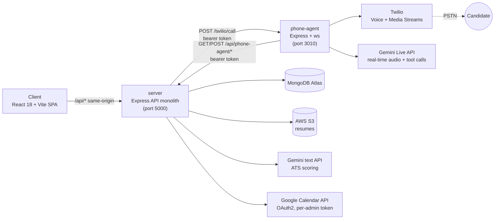
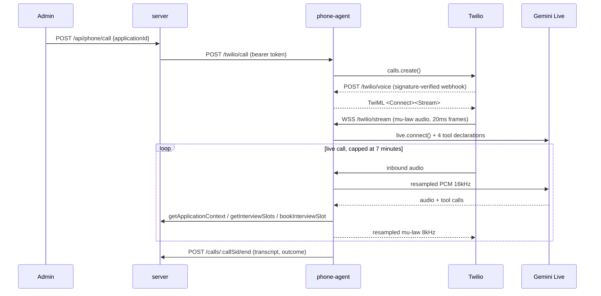

# VoiceHire

A recruiting platform where candidates apply with resume-based ATS scoring, and admins can trigger an AI voice agent to run the initial phone screen — live, over a real phone call, with Google Calendar booking built in.

**Live:** [voicehire-app-504906223885.asia-south1.run.app](https://voicehire-app-504906223885.asia-south1.run.app) (Cloud Run, `asia-south1`)

## Why this exists

Two things a recruiter normally does by hand — reading resumes against a job spec, and running a first-pass phone screen — are both amenable to automation, but for different reasons: resume matching is a scoring problem (LLM-graded against structured criteria), while phone screening is a real-time conversation problem (audio in, audio out, tool calls to look up context and book time). This project treats them as two separate services with different runtime shapes — a request/response API for the former, a persistent WebSocket audio bridge for the latter — rather than forcing both into one process. `phone-agent` bridges a Twilio call to Gemini's Live audio API and calls back into the main API for candidate context, calendar availability, and booking, so the "interview" is a genuine phone call an AI conducts end to end, not a scripted IVR.

## Architecture



The two services never share memory or a database connection — every cross-service call is authenticated HTTP with a shared bearer token (`VOICEHIRE_SERVICE_TOKEN`), verified with a timing-safe comparison on both sides.

### Interview call flow



At 5 minutes a synthetic "wrap up" turn is injected; at 7 minutes the call is torn down unconditionally, regardless of conversation state. That's a deliberate substitute for Gemini Live's session-resumption feature (see highlights below).

## Engineering highlights

- **A silent, total scoring failure from a regex typo.** ATS scoring parsed Gemini's response with literal-string regexes like `/SKILLS:\\s*(\\d+)/i` — in a JS regex *literal*, `\\s` matches a backslash character, not whitespace. Every real response failed the structured parse and the single-number fallback (same bug), so `generateATSScore` reliably threw after 3 retries. The bug had been invisible because an earlier Gemini quota error was masking it. Fixed by de-escaping all six affected literals and re-verified against structured, markdown-fenced, and malformed sample responses.
- **Traded session resumption for a hard time budget.** Gemini Live has an undocumented-in-code (but real) ~10-minute connection ceiling, and this codebase configures no `sessionResumption`/`contextWindowCompression`. Rather than build reconnect logic, calls are capped by design: a wrap-up nudge at 5 minutes, a hard `closeAll()` at 7 — comfortably inside the ceiling, with the tradeoff that a slow-talking candidate gets cut off rather than extended.
- **Narrowed, not closed, a double-booking race.** `scheduleInterview` originally went straight to `calendar.events.insert`. It now re-runs `freebusy.query` for the exact slot window immediately before the insert and returns `409` if it's gone busy — closing the "stale availability read from earlier in the call" gap, while leaving (and documenting) the smaller TOCTOU window between that re-check and the write itself, since a real fix needs a reservation lock, not another read.
- **An unauthenticated endpoint that could place real phone calls.** `POST /twilio/call` on the phone-agent had no auth — anything that could reach the port could trigger a real outbound Twilio call (and charge). Fixed with the same shared-bearer-token + timing-safe-compare pattern already used for the reverse direction (`requirePhoneAgent`), applied only to `/call` — `/voice` stays public since it's Twilio's own signature-verified webhook.
- **Cloud Run surfaced a logging assumption.** Winston's console transport was disabled in production on the assumption that file logs were enough — true for a persistent host, false for Cloud Run, which only captures stdout/stderr. Fixed to always log to console, switching format to structured JSON in production and colorized text otherwise.

## Tech stack

| Layer | Stack |
|---|---|
| Client | React 18, TypeScript, Vite 5, Tailwind CSS, Radix UI primitives, React Router, React Hook Form + Zod, TanStack Table, Recharts, `@react-oauth/google` |
| Server | Node 22 (ESM), Express 4, MongoDB + Mongoose 8, `googleapis`/`google-auth-library` (OAuth + Calendar), `@google/generative-ai` (Gemini text), AWS SDK v3 (S3), `jsonwebtoken`, `bcryptjs`, `multer`, `pdf-parse`/`mammoth`, `luxon`, Winston, Helmet |
| phone-agent | Node (ESM), Express 4 + `ws`, `@google/genai` (Gemini **Live**, real-time audio — a different SDK/product from the server's text Gemini client), Twilio SDK |
| Infra | Docker (multi-stage build, client bundled into the server image as static assets), Docker Compose (+ an `ngrok` sidecar for local Twilio webhook testing), Google Cloud Run, MongoDB Atlas, AWS S3 |

## Quick start

```bash
npm install
npm install --prefix client
npm install --prefix server
npm install --prefix phone-agent

cp .env.example .env   # fill in Mongo/Google/Gemini/AWS/Twilio values

npm run dev             # runs client (3000), server (5000), phone-agent (3010) concurrently
```

The Vite dev server proxies `/api` to `http://localhost:5000`, so the client always calls a relative `/api/...` path. Voice testing needs a public HTTPS endpoint for Twilio — either run `ngrok http 3010` and set `PUBLIC_BASE_URL`/`PHONE_AGENT_BASE_URL` by hand, or set `NGROK_API_URL=http://127.0.0.1:4040` and let the phone-agent read the tunnel URL from ngrok's local API.

**Docker** (production-like, Atlas-backed):

```bash
docker compose up --build   # app (5000) + phone-agent (3010) + ngrok sidecar (4040)
```

## Testing

There is no automated test suite (no test files, no test runner in any `package.json`). Correctness is currently established by:
- `scripts/smoke.mjs` (`npm run smoke`) — hits `/health` after boot.
- `server/scripts/checkCalendarTokens.mjs` — exercises a real Google OAuth token refresh for every connected admin, meant to run on a schedule, to catch a revoked/expired Calendar grant before a candidate hits it mid-call.
- `server/scripts/backfillJobRecruiterId.mjs` — one-off data migration for the `Job.recruiterId` field.

This is a real gap, not an oversight to gloss over — features have been verified manually against a live dev database rather than by a repeatable suite.

## Project structure

```
├── client/                 # React 18 + Vite SPA
│   └── src/
│       ├── components/     # admin-dashboard/, user-dashboard/, ui/ (Radix-based)
│       ├── context/        # AuthContext, DashboardContext
│       ├── pages/          # AuthPage, Dashboard, OnboardingPage, ProfilePage, RegisterPage
│       └── lib/             # api.ts (fetch client w/ GET cache), googleAuthApi.ts
├── server/                 # Express API monolith
│   └── src/
│       ├── controllers/    # one per resource, incl. phoneAgentController, calendarController
│       ├── services/       # ATSScoreService, ResumeParserService, GoogleCalendarService, ...
│       ├── models/         # User, Job, Application, CallSession, TokenBlacklist
│       ├── middleware/     # auth.js, requirePhoneAgent.js, rateLimiter.js, upload.js
│       └── routes/         # mounted under /api/* in app.js
├── phone-agent/             # Twilio <-> Gemini Live bridge
│   └── src/
│       ├── twilio.routes.js        # /twilio/call, /twilio/voice
│       ├── twilio.mediaStream.js   # WebSocket audio bridge (/twilio/stream)
│       ├── gemini.liveSession.js   # Gemini Live session + tool dispatch
│       ├── audio.pipeline.js       # mu-law <-> PCM codec/resampler
│       └── voicehireClient.js      # authenticated calls back into server
├── docker-compose.yml       # app + phone-agent + ngrok sidecar
├── docker-compose.mongo.yml # optional local Mongo container
└── scripts/                 # smoke.mjs, deploy-gcp.ps1 (manual Cloud Run runbook)
```

## Deployment

Deployed to Google Cloud Run (`asia-south1`) as two independent services — `voicehire-app` (Express API + built SPA, `--min-instances=0`) and `voicehire-phone-agent` (`--min-instances=1 --no-cpu-throttling`, kept warm since it holds a persistent WebSocket per call). Secrets (`JWT_SECRET`, `GOOGLE_CLIENT_SECRET`, `GEMINI_API_KEY`, `MONGODB_URI`, `TWILIO_AUTH_TOKEN`, `VOICEHIRE_SERVICE_TOKEN`, `AWS_SECRET_ACCESS_KEY`) are injected via Secret Manager, not env vars. `scripts/deploy-gcp.ps1` is a manual runbook (not CI/CD): phone-agent deploys first so its URL is known before the app deploys, then both services get a fast `services update` pass to wire in each other's real URLs. The client is built with no `VITE_API_BASE_URL`, so the SPA calls `/api` same-origin against whichever host serves it — no separate rebuild needed per environment.
